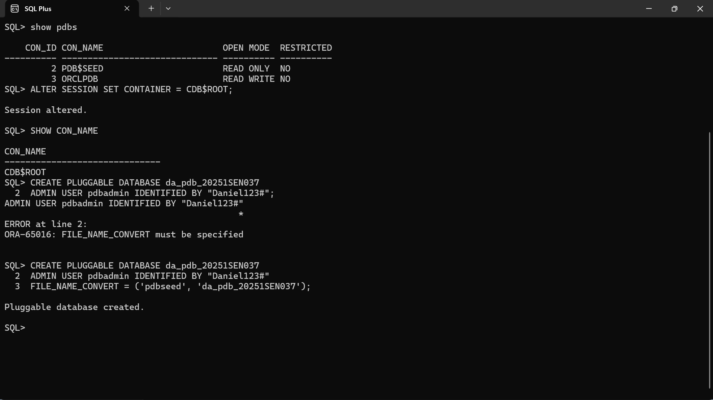
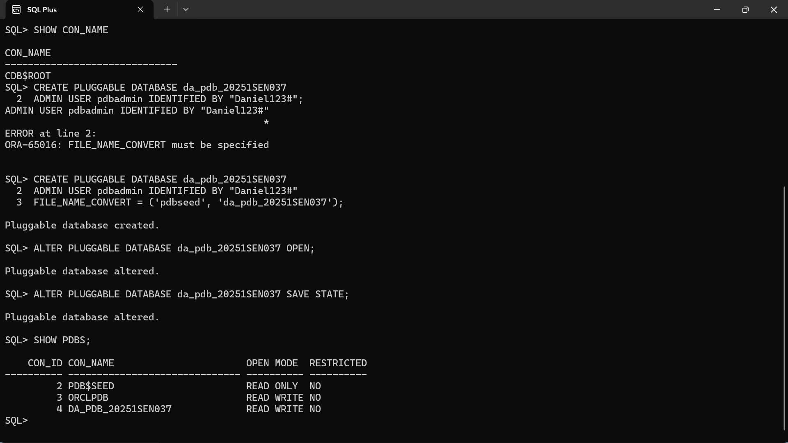
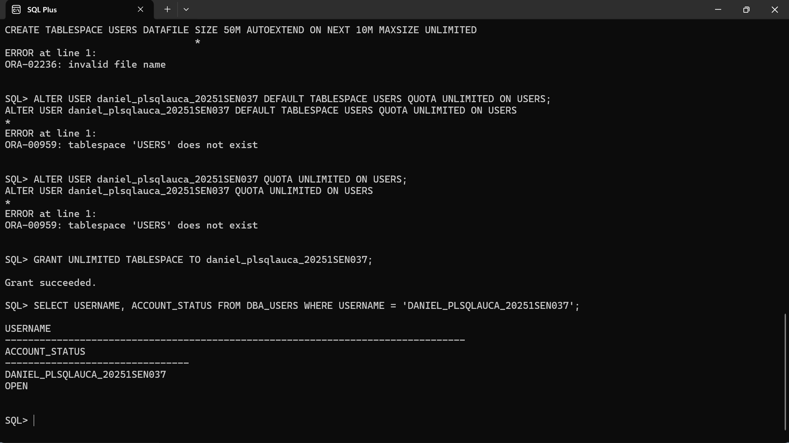
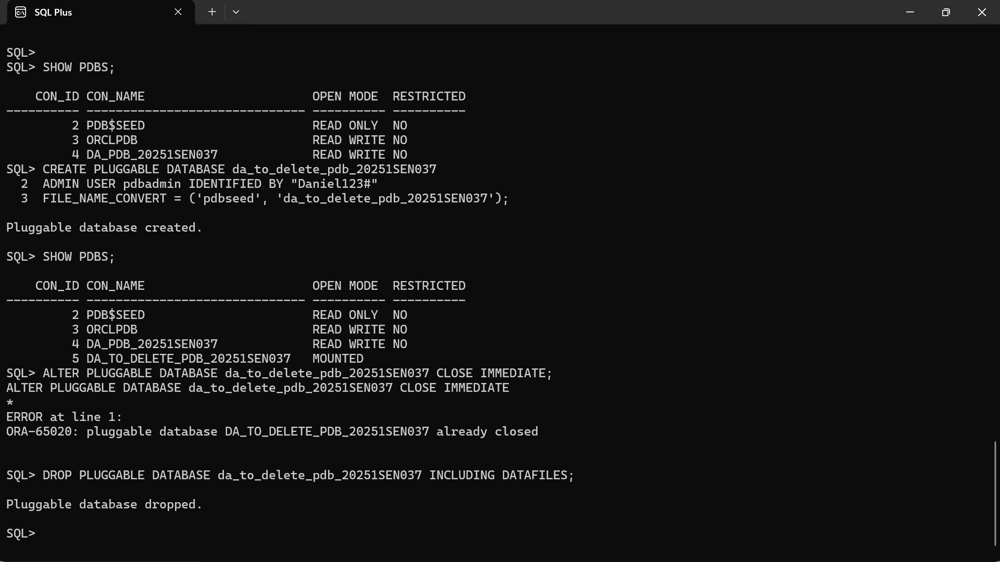
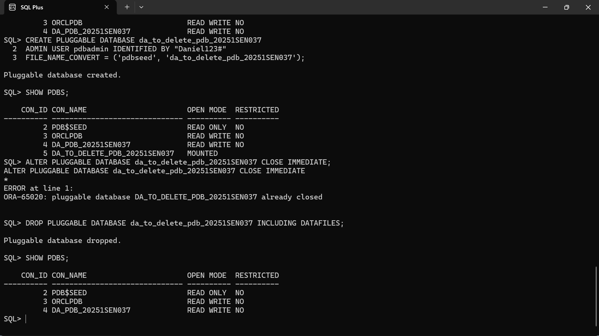
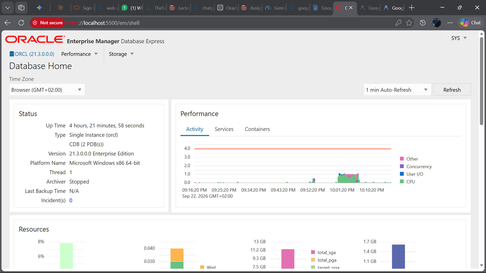

# Oracle Pluggable Databases (PDB) Management

**Course:** Database Development with PL/SQL (INSY 8311)  
**Student Name:** Daniel  
**Student ID:** 20251SEN037  
**Instructor:** Eric Maniraguha  
**Submission Date:** September 22, 2026  

---

## 📋 Submission Details Block
- **Repository Link:** https://github.com/[Danny17-alt]/oracle_pdb_ass_II_20251SEN037_daniel
- **PDB Name Created:** da_pdb_20251SEN037
- **Issues Encountered:** No

---

## 1. Overview
This practical project demonstrates administrative tasks in Oracle Multitenant Architecture (CDB/PDB) on Oracle Database 21c. The core objectives include:
1. Creating, configuring, and opening a persistent Pluggable Database (`da_pdb_20251SEN037`).
2. Creating and provisioning an administrative local user account (`daniel_plsqlauca_20251SEN037`) inside the PDB for ongoing academic work.
3. Creating, verifying, and dropping a temporary PDB (`da_to_delete_pdb_20251SEN037`) along with its physical datafiles.
4. Accessing and validating the Oracle Enterprise Manager (OEM) Database Express management interface.

---

## 2. Oracle Environment
| Component | Specification |
| :--- | :--- |
| **Database Edition** | Oracle Database 21c (21.3.0.0.0) Enterprise Edition |
| **Architecture** | Multitenant Container Architecture (CDB/PDB) |
| **Operating System** | Microsoft Windows (x64) |
| **Client Administration Tools** | SQL*Plus, Oracle SQL Developer |
| **Web Management** | Oracle Enterprise Manager (OEM) Database Express 21c |
| **Default Port** | 1521 (Listener), 5500 (OEM HTTPS) |

---

## 3. Tasks Accomplished & Evidence

### Task 1: Create a New Pluggable Database & Local User

#### 1.1 Creating the Pluggable Database
The pluggable database was created from the seed database template (`PDB$SEED`) within the root container `CDB$ROOT`:
```sql
CREATE PLUGGABLE DATABASE da_pdb_20251SEN037 
ADMIN USER pdbadmin IDENTIFIED BY "Daniel123#" 
FILE_NAME_CONVERT = ('pdbseed', 'da_pdb_20251SEN037');
```


#### 1.2 Opening the PDB & Saving State
The PDB was opened in `READ WRITE` mode and configured to automatically reopen upon instance startup:
```sql
ALTER PLUGGABLE DATABASE da_pdb_20251SEN037 OPEN;
ALTER PLUGGABLE DATABASE da_pdb_20251SEN037 SAVE STATE;
SHOW PDBS;
```


#### 1.3 Creating and Verifying the Local User
Session context was shifted to `da_pdb_20251SEN037` to provision the persistent course user:
```sql
ALTER SESSION SET CONTAINER = da_pdb_20251SEN037;
CREATE USER daniel_plsqlauca_20251SEN037 IDENTIFIED BY "Daniel123#";
GRANT CONNECT, RESOURCE, DBA TO daniel_plsqlauca_20251SEN037;
GRANT UNLIMITED TABLESPACE TO daniel_plsqlauca_20251SEN037;
```
Verification query:
```sql
SELECT USERNAME, ACCOUNT_STATUS, CREATED 
FROM DBA_USERS 
WHERE USERNAME = 'DANIEL_PLSQLAUCA_20251SEN037';
```


---

### Task 2: Create and Delete a Temporary PDB

#### 2.1 Creation of Temporary PDB
Switched to `CDB$ROOT` and created `da_to_delete_pdb_20251SEN037`:
```sql
ALTER SESSION SET CONTAINER = CDB$ROOT;
CREATE PLUGGABLE DATABASE da_to_delete_pdb_20251SEN037 
ADMIN USER pdbadmin IDENTIFIED BY "Daniel123#" 
FILE_NAME_CONVERT = ('pdbseed', 'da_to_delete_pdb_20251SEN037');
SHOW PDBS;
```


#### 2.2 Complete Removal of Temporary PDB
Closed and dropped the temporary pluggable database including all physical datafiles:
```sql
ALTER PLUGGABLE DATABASE da_to_delete_pdb_20251SEN037 CLOSE IMMEDIATE;
DROP PLUGGABLE DATABASE da_to_delete_pdb_20251SEN037 INCLUDING DATAFILES;
SHOW PDBS;
```


---

### Task 3: Oracle Enterprise Manager (OEM) Monitoring
Configured Oracle XML DB (XDB) HTTPS port to 5500:
```sql
EXEC DBMS_XDB_CONFIG.SETHTTPSPORT(5500);
```
Connected securely to OEM Database Express via web browser (`https://localhost:5500/em`) as `SYS` (`SYSDBA`) to review the database architecture and ensure `da_pdb_20251SEN037` was active and healthy.



---

## 4. Challenges Faced & Solutions
1. **Tablespace Specification in Newly Cloned PDB (`ORA-00959`):**
   - *Challenge:* When assigning quotas on the default `USERS` tablespace, the system returned `ORA-00959: tablespace 'USERS' does not exist` because a newly cloned PDB inherits only `SYSTEM`, `SYSAUX`, and `TEMP` by default.
   - *Solution:* Granted `UNLIMITED TABLESPACE` directly to the DBA account `daniel_plsqlauca_20251SEN037`, successfully establishing storage allocation rights without interrupting initialization.
2. **File Mapping on Windows Environment (`ORA-65016`):**
   - *Challenge:* Creating a PDB without default Oracle Managed Files (OMF) triggered `ORA-65016: FILE_NAME_CONVERT must be specified`.
   - *Solution:* Supplied `FILE_NAME_CONVERT = ('pdbseed', '<new_pdb_name>')` so Oracle could clone and rename seed datafiles automatically.

---

## 5. Integrity Statement
I solemnly confirm that this submission, including all SQL operations, database objects, configurations, and screenshots, represents my own original practical work for INSY 8311, conducted with strict adherence to academic integrity and university guidelines.
